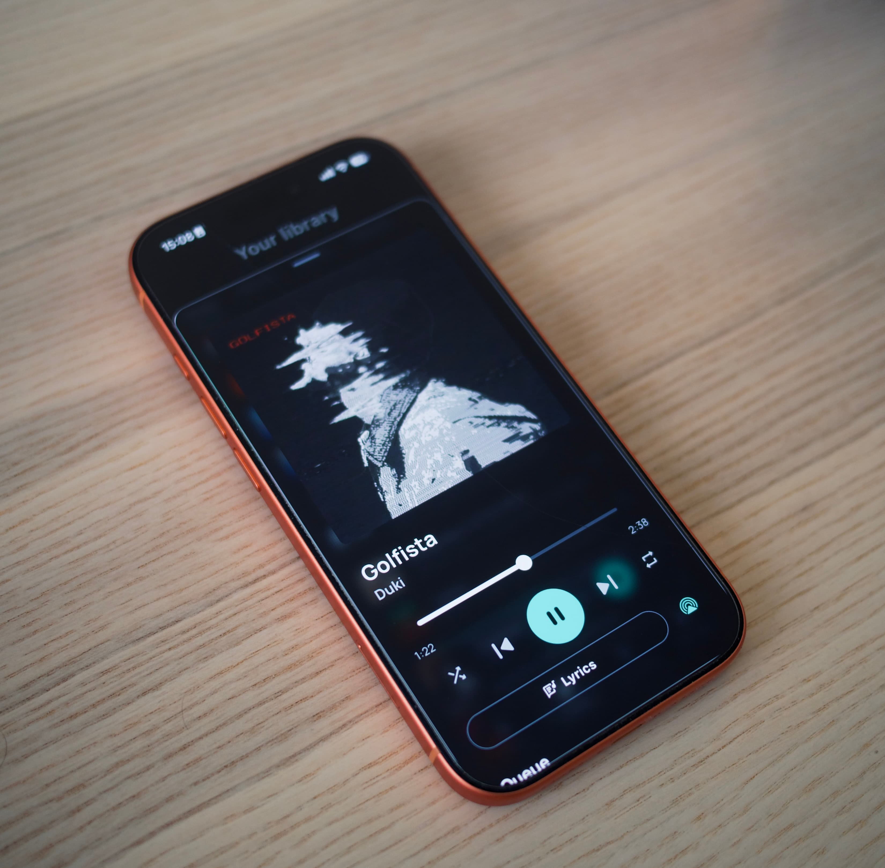
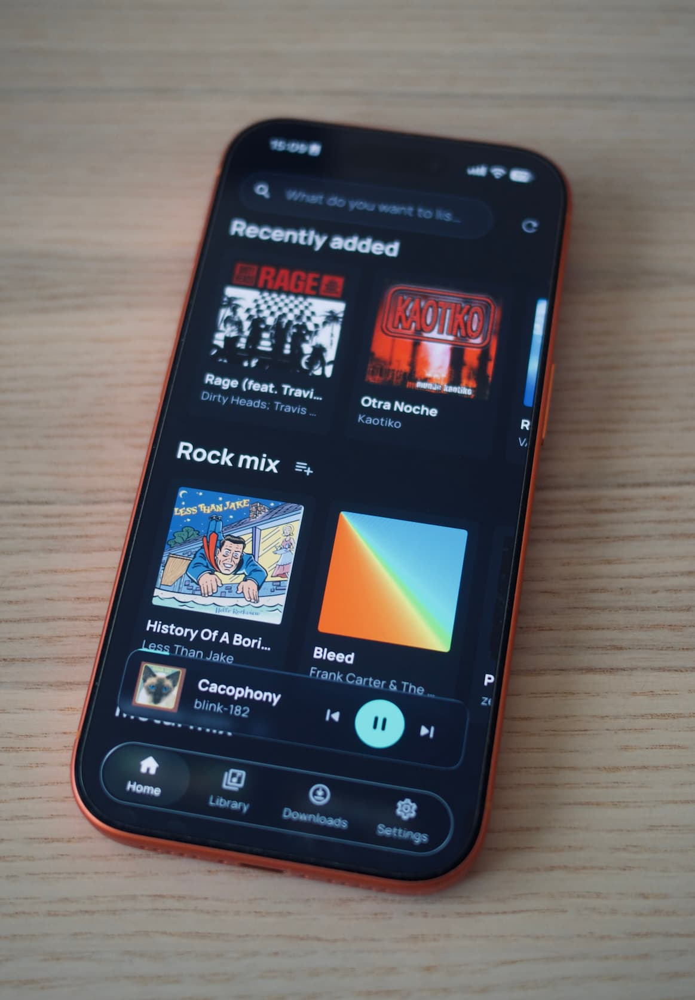
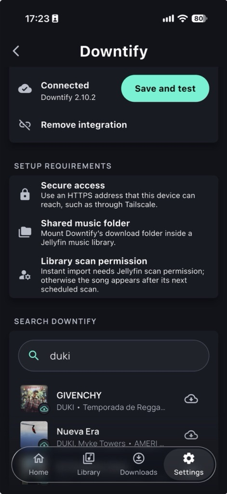
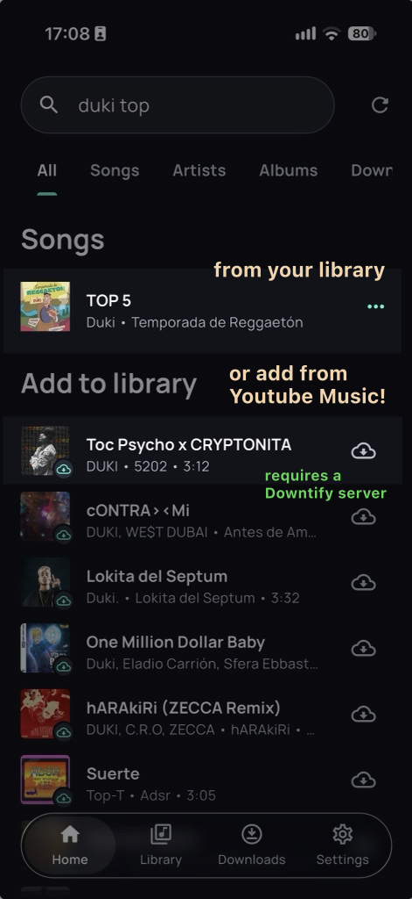

Spotifin is a free, open-source, Spotify-style music player that connects to your existing Jellyfin library. It aims to be your goto player EVERYWHERE.

> [!IMPORTANT]
> This app is highly vibecoded and if you are not fine with that, please don't use it.

> [!WARNING]
> This is a work in progress. Expect bugs. We are not even in alpha.

## Ways to listen

| Platform | How |
| --- | --- |
| ⭐ **Web — start here** | **[spotifin.app](https://spotifin.app)** — your library, all features, even downloads, on every device, no install |
| 📱 iPhone / iPad | [`.ipa` from Releases](https://github.com/pablopunk/spotifin/releases) → sideload with [Sideloadly](https://sideloadly.io). App Store build may come soon (without Downtify) |
| 🤖 Android | [APK / AAB from Releases](https://github.com/pablopunk/spotifin/releases) — offline downloads. Play Store might come soon too |
| 🍎 macOS | [signed universal zip from Releases](https://github.com/pablopunk/spotifin/releases) |
| 🪟 Windows | [x64 zip from Releases](https://github.com/pablopunk/spotifin/releases) |
| 🐧 Linux | [AppImage (x64 + arm64) from Releases](https://github.com/pablopunk/spotifin/releases) |

| Web app  | Web app (responsive) |
| -------- | -------- |
|  | 

| iOS App (player)  | iOS App (library) |
| -------- | -------- |
|  |  |

## *Download songs* to your library with the [Downtify](https://downtify.henriquesebastiao.com/) integration

Select your Downtify server and search results will include Downtify songs you can add to your library with one click.

| Downtify config | Downtify integration |
| -------- | -------- |
|  |  |
